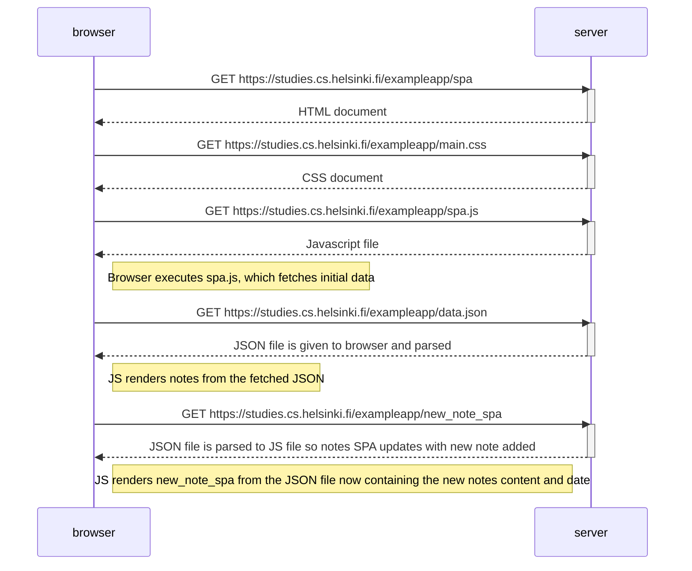

# New Note Diagram

```mermaid
sequenceDiagram
    participant browser
    participant server

    browser->>server: GET https://studies.cs.helsinki.fi/exampleapp/spa
    activate server
    server-->>browser: HTML document
    deactivate server

    browser->>server: GET https://studies.cs.helsinki.fi/exampleapp/main.css
    activate server
    server-->>browser: CSS document
    deactivate server

    browser->>server: GET https://studies.cs.helsinki.fi/exampleapp/spa.js
    activate server
    server-->>browser: Javascript file
    deactivate server

    Note right of browser: Browser executes spa.js, which fetches initial data

    browser->>server: GET https://studies.cs.helsinki.fi/exampleapp/data.json
    activate server
    server-->>browser: JSON file is given to browser and parsed
    deactivate server

    Note right of browser: JS renders notes from the fetched JSON

    browser->>server: GET https://studies.cs.helsinki.fi/exampleapp/new_note_spa
    activate server
    server-->>browser: JSON file is parsed to JS file so notes SPA updates with new note added
    deactivate server

    Note right of browser: JS renders new_note_spa from the JSON file now containing the new notes content and date
```
